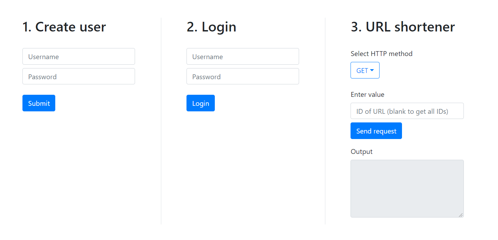

# Web Services and Cloud-Based Systems - Assignment 3

## Build and run containers using Compose
```
docker-compose up -d
```
- The user service runs on http://localhost:2000
- The URL shortener runs on http://localhost:4000

## Run React front-end (optional)
```
cd frontend
npm i
npm start
```
The React app can be accessed in your browser from http://localhost:3000.

## Test containers
```
docker images
```
You should see that images for each of the web services have been created.
```
docker ps
```
You should see both containers running.


## How to use React front-end

### 1. Create user
There are no restrictions for username or password format, but both fields need to be filled in.  

The user is stored in a local array, and will not be saved when the application is exited.

### 2. Login
Enter a user's username and password to get access to the URL shortener service.

### 3. URL shortener
Use the dropdown to select the type of action you want to perform: **GET**, **POST**, **PUT** or **DELETE**.  

- GET
  - Enter the ID of a URL to retrieve the full URL
  - Leave the input field blank to retrieve the IDs of all stored URLs
- POST
  - Enter a URL to shorten. The URL must be properly formatted  (e.g. http://*www.example.com*)
- PUT
  - Enter the ID of a URL to update
  - Enter the new URL that you want to associate with the ID
- DELETE
  - Enter the ID of a URL to delete
  - Leave the input field blank to delete all stored URLs 

